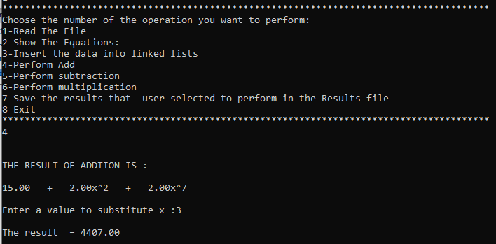

# Polynomial ADT Using LinkedList

This project is a **C program** that reads a polynomial equation from an input file, performs **addition, subtraction, and multiplication** operations on the polynomials, and substitutes a value for `x` in the final equation. The project uses **linked lists** to manage the polynomials.

## Features

- **Read polynomial equations from an input file**
- **Perform addition, subtraction, and multiplication on polynomial equations**
- **Substitute a given value for `x` in the final polynomial equation**

## Format for Input Equations

The input file should contain polynomial equations in the following format:

## Program Menu

